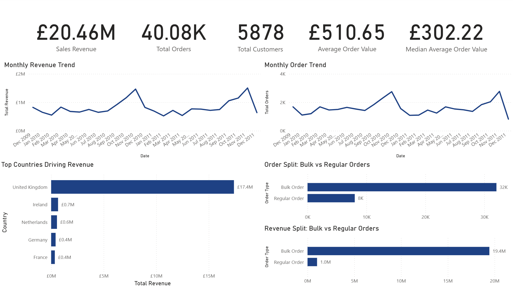
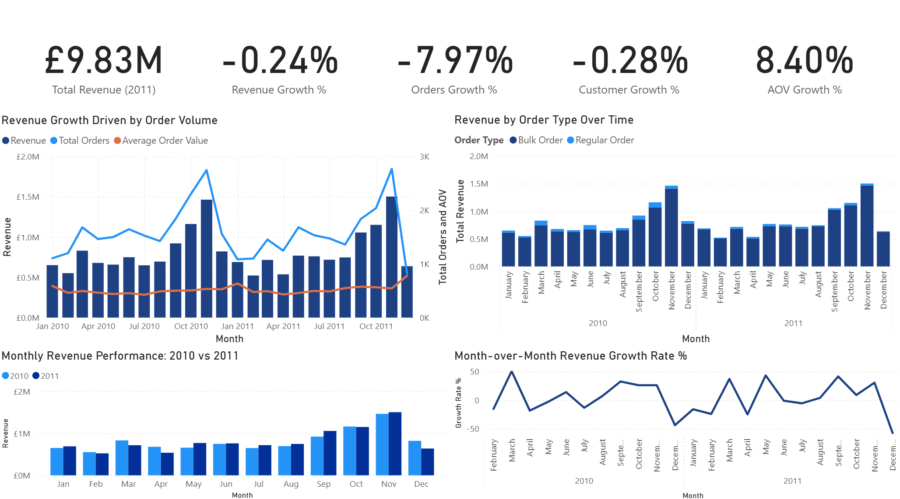
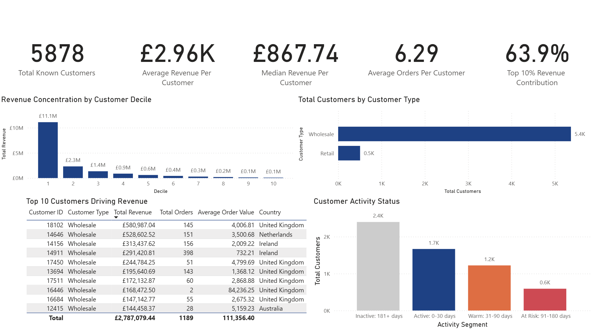
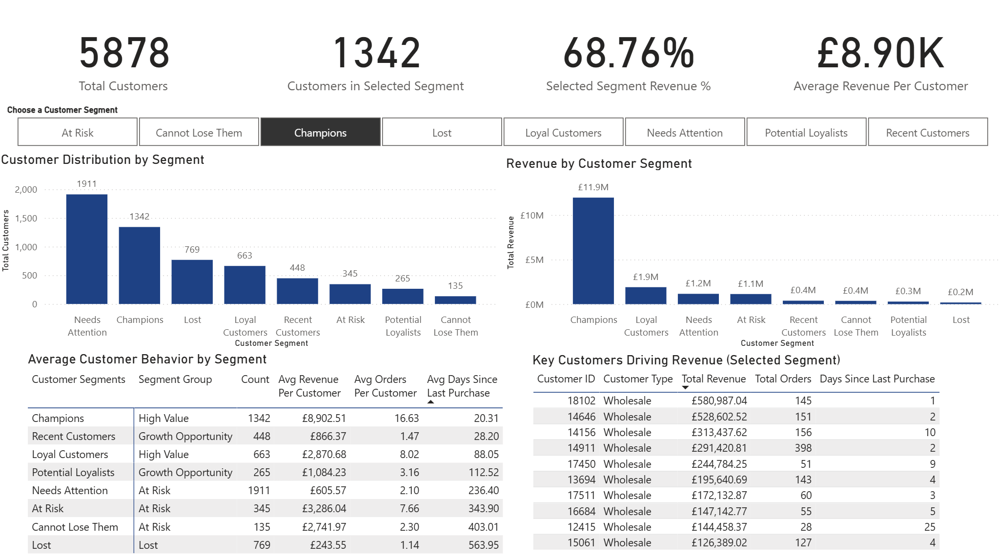

# E-commerce Customer Analytics: Revenue Insights and Segmentation Strategy

## Project Overview  
This project analyzes over 1 million transactional records from a UK-based e-commerce retailer between December 2009 and December 2011 to evaluate business performance, identify key revenue drivers, and uncover customer segmentation and retention opportunities.

Using Python, PostgreSQL, and Power BI, the analysis explores revenue trends, customer behavior, and growth patterns. The analysis transforms transactional data into actionable insights that support revenue growth and customer retention strategies.

## Key Business Questions

- How has revenue performance changed over time?
- What factors are driving growth or decline?
- Which customers generate the most value?
- Where are the biggest retention and growth opportunities?

## Tools Used

- Python (Data Cleaning & Feature Engineering)
- PostgreSQL (Data Analysis & SQL Views)
- Power BI (Dashboard & Visualization)

## Dashboard Preview

### Executive Overview

### Growth Analysis

### Customer Analysis

### RFM Segmentation

## Key Insights

- Revenue remained stable with a slight decline driven by lower order volume, not pricing  
- Wholesale customers generate the majority of revenue and dominate business performance  
- Revenue is highly concentrated, with the top 10% of customers contributing over 60% of total sales  
- A large portion of customers fall into “At Risk” segments, indicating churn risk  
- Newer segments such as “Recent Customers” and “Potential Loyalists” present strong growth opportunities 

## Business Recommendations

- Increase marketing efforts during peak seasonal months (September–November) to maximize revenue  
- Focus on driving order volume through bundling, cross-selling, and bulk incentives  
- Prioritize retention of high-value customers through personalized offers and loyalty programs  
- Launch targeted campaigns to re-engage "At Risk" customers and reduce churn

## Project Workflow

1. Data cleaning and feature engineering using Python  
2. Data modeling and analysis using PostgreSQL  
3. Development of SQL views 
4. Dashboard creation in Power BI  
5. Business analysis and recommendation report

## Repository Structure

01_python → data cleaning and preprocessing scripts  
02_sql → SQL queries and analytical views  
03_dashboard → Power BI file  
04_dashboard_images → preview of dashboards  
05_report → final business report (PDF)  

## Full Report
[Download the Full Business Report](https://github.com/Dillonkw/ecommerce-customer-analytics/blob/main/05_report/ecommerce_revenue_customer_segmentation_report.pdf)

